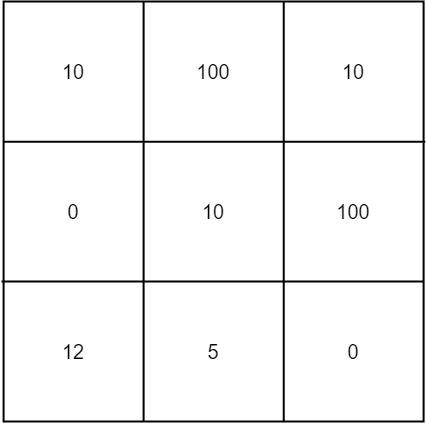
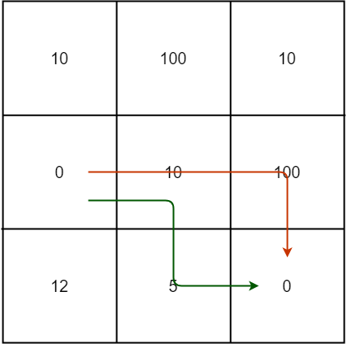

**นิยามของคำถามสำหรับคนที่ไม่เข้าใจโจทย์**

สมมติให้ตารางค่าเสน่ห์เป็นดังนี้



จะขอยกตัวอย่างมา 2 เส้นทาง (เส้นสีแดง, เส้นสีเขียว)



จะเห็นว่าเส้นทางสีแดงจะมีค่าเสน่ห์มากที่สุด $max(0, 10, 100, 0) = 100$
เส้นทางสีเขียวจะมีค่าเสน่ห์มากที่สุด $max(0, 10, 5, 0) = 10$
ซึ่งค่าที่น้อยที่สุดคือ $min(10, 100) = 10$ 
นำค่าที่ได้ไปเทียบกับเส้นทางอื่นๆ ให้ครบทุกเส้นทาง แล้วจะได้ค่าเสน่ห์มากที่สุดที่น้อยที่สุดออกมา

#### 
**แนวคิด**

สมมติให้ค่าเสน่ห์ที่มากที่สุดที่สามารถทนได้และทำให้ไปหาถึงกันได้คือ $x$
แปลว่าตลอดทางที่ทั้งคู่เดินนั้นจะต้องไม่ผ่านเด็กสาวที่มีค่าเสน่ห์มากกว่า $x$ เลย

เราจะหาค่า $x$ ที่น้อยที่สุด 
โดยสังเกตว่า ถ้าเราให้คำตอบของคำถามคือ $x$ ค่าที่มากกว่า $x$ ทั้งหมดจะสามารถทำให้เงื่อนไขโจทย์เป็นจริง แต่จะไม่ใช่คำตอบเนื่องจากไม่ใช่ค่าที่น้อยที่สุด และค่าที่น้อยกว่า $x$ ทั้งหมดไม่ทำให้เงื่อนไขโจทย์เป็นจริง

ดังนั้นเราจะ **Binary Search** เพื่อหาค่า $x$

ในการทำ Binary Search นั้นเราจะใช้ **BFS (Breadth First Search)** หรือ **DFS (Depth First Search)** เพื่อเช็คว่าค่ากึ่งกลางที่เราได้มาสามารถเดินตามเงื่อนไขโจทย์ได้หรือไม่ 

โดยเราจะทำ BFS / DFS ภายใต้เงื่อนไขที่ว่าเราจะไม่เดินเข้าไปในช่องที่มีค่ามากกว่าค่าที่เราต้องการตรวจสอบ ถ้าสามารถเดินไปถึงจุดหมายได้ (เลข 0 อีกที่ในตาราง) แสดงว่าค่านั้นอาจเป็นคำตอบหรืออาจมีคำตอบที่มีค่าน้อยกว่านั้นก็ได้ แต่ถ้าไม่สามารถทำได้แสดงว่าคำตอบมีค่ามากกว่าค่านี้

โค้ดด้านล่างใช้ BFS เป็นเงื่อนไขของ Binary Search

Time Complexity: $\mathcal{O}(n^{2}\log{}n)$

```cpp
#include <bits/stdc++.h>

using namespace std;

typedef pair<int, int> ii;
const int MXN = 1005;

bool pass[MXN][MXN];
int di[4][2] = {{1, 0}, {-1, 0}, {0, 1}, {0, -1}};
int field[MXN][MXN], n;

bool bfs(int l) {
  queue<ii> q;
  bool first_zero = true, isfirst = true;
  for (int i = 1; i <= n; i++) {
    for (int j = 1; j <= n; j++) {
      pass[i][j] = false;
      if (first_zero && field[i][j] == 0) {
        q.emplace(i, j);
        first_zero = false;
      }
    }
  }
  while (q.size()) {
    int x = q.front().first;
    int y = q.front().second;
    q.pop();
    if (x <= 0 || y <= 0 || x > n || y > n || pass[x][y])
      continue;
    pass[x][y] = true;
    if (field[x][y] == 0 && isfirst)
      isfirst = false;
    else if (field[x][y] == 0)
      return true;
    if (field[x][y] > l)
      continue;
    for (int i = 0; i < 4; i++) {
      q.emplace(x + di[i][0], y + di[i][1]);
    }
  }
  return false;
}

int main() {
  scanf("%d", &n);
  for (int i = 1; i <= n; i++) {
    for (int j = 1; j <= n; j++) {
      scanf("%d", &field[i][j]);
    }
  }
  int f = 1, s = 1e9, ans;
  while (f <= s) {
    int m = (f + s) >> 1;
    if (bfs(m)) {
      s = m - 1;
      ans = m;
    } else {
      f = m + 1;
    }
  }
  printf("%d", ans);
}
```
