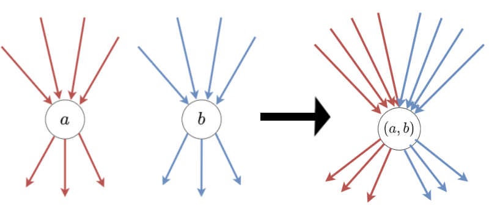

เราสามารถมองปัญหานี้เป็น Directed Graph ได้ดังนี้
1. พรรคการเมืองแต่ละพรรค เป็น *node* (หลังจากนี้ จะขอเรียก ***node ของพรรค x*** ว่า $x$ เฉยๆ)
2. หากมีข้อมูลระบุว่า พรรค $a$  มีคะแนน *น้อยกว่า* พรรค $b$  ให้**สร้างเส้นเชื่อม**ที่มีทิศทางจาก  $a$ ไปยัง $b$
3. ในทางตรงกันข้าม หากมีข้อมูลระบุว่า พรรค $a$  มีคะแนน *มากกว่า* พรรค $b$  ให้**สร้างเส้นเชื่อม**ที่มีทิศทางจาก $b$ ไปยัง $a$
4. หากมีข้อมูลระบุว่า พรรค $a$ มีคะแนน *เท่ากับ* พรรค $b$ ให้เราสร้าง $node$ ใหม่ขึ้นมา ขอเรียกโหนดนั้นว่า $(a,b)$ และให้  
	* เปลี่ยนทิศทาง ของ เส้นเชื่อมที่*ชี้มายัง* $a$ หรือ $b$ ทั้งหมด ให้ชี้มายัง $(a,b)$ แทน
	* ในทำนองเดียวกัน เส้นเชื่อมที่*ชี้ออกจาก* $a$ หรือ $b$ ทั้งหมด ให้มาชี้ออกจาก $(a,b)$ แทน
	* กล่าวได้ว่า เราทำการผสานโหนด $a$ และ $b$ เป็นโหนดเดียวกันนั่นเอง

  

จะได้ว่า โจทย์ข้อนี้ก็คือปัญหา [**Topological Sorting**](https://en.wikipedia.org/wiki/Topological_sorting#:~:text=In%20computer%20science%2C%20a%20topological,before%20v%20in%20the%20ordering.) สุดคลาสสิกนั่นเอง  

ในการ implement เราสามารถใช้เทคนิค [**Sack**](https://codeforces.com/blog/entry/44351) เข้ามาช่วยในการผสานโหนดได้อย่างมีประสิทธิภาพ  
แต่มีวิธีที่เรียบง่ายกว่าคือ การทำแบบ off-line โดยรับข้อมูลเข้ามาทั้งหมดก่อน แล้วทำการผสานโหนดที่คะแนนเท่ากันด้วย [**Disjoint Set Union**](https://en.wikipedia.org/wiki/Disjoint-set_data_structure) แล้วจึงค่อยทำการสร้างเส้นเชื่อมนั่นเอง

Time Complexity : $\mathcal{O}(M*\alpha(n))$ โดยที่ $\alpha(n)$ คือ [*Inverse Ackermann Function*](https://en.wikipedia.org/wiki/Ackermann_function)   
Space Complexity : $\mathcal{O}(N+M)$
