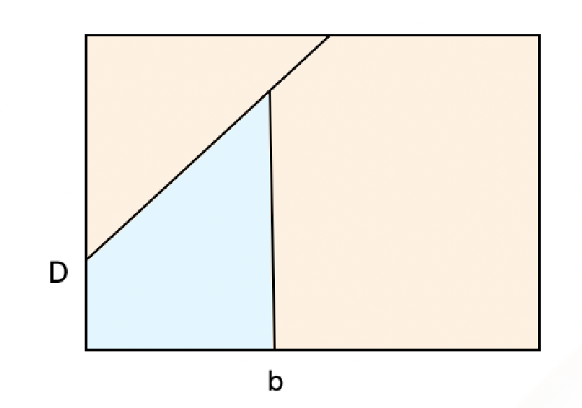
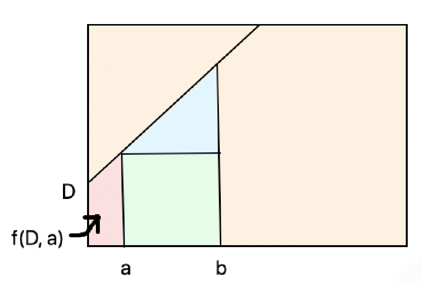

ข้อนี้มีวิธีทำได้หลายวิธี แต่วิธีที่จะนำเสนอเป็นวิธีที่ผู้เขียนคิดว่าตรงไปตรงมาที่สุด

เริ่มต้นเราจะกำหนดการอ้างอิงตำแหน่งบนตารางเป็นแบบ 1-indexed (เริ่มต้นที่ 1) และจะนิยามแนวแทยงแนวหนึ่งเป็นทุก ๆ ช่องที่มีผลรวมของตำแหน่งแถวและหลักเป็นค่าเดียวกัน (นั่นคือ แนวแทยงคือช่องที่มี $D = i+j$ เท่ากัน โดย $2 \leq D \leq 2N$)

จากนั้นเราจะนิยาม $f(D, b)$ เป็นผลรวมของสี่เหลี่ยมดังรูปด้านล่าง นั่นคือ $f(D, b)$ จะมีค่าเท่ากับ ผลรวมของทุก ๆ ช่อง $(x, y)$ ที่ $x+y \geq D$ และ $y \leq b$ โดยที่ถ้า $x+y = D$ ให้หาบวกแค่ครึ่งเดียว

สังเกตว่า คำตอบของคำถามใด ๆ จะสามารถคำนวณได้โดยใช้แค่ $f$ และผลรวมของตัวเลขในสี่เหลี่ยมมุมฉากด้านล่างของมัน ดังรูปด้านล่าง

นั่นคือ พื้นที่สีฟ้า จะมีค่าเท่ากับ $f(D, b)-f(D,a)$ ลบด้วยพื้นที่สีเขียว

ดังนั้นเราจำเป็นจะต้องทำสองสิ่ง

- query และ point update ค่า $f(D, a)$ ให้ได้เร็ว ๆ
- query และ point update ผลบวกของสี่เหลี่ยมมุมฉากใด ๆ ให้ได้เร็ว ๆ

สิ่งที่ 2 นั้นค่อนข้างตรงไปตรงมา สามารถทำได้ด้วย 2D Query Structure โดยในที่นี้จะแนะนำ 2D Fenwick Tree เนื่องจากเป็นโครงสร้างข้อมูลที่เขียนค่อนข้างง่าย

เรามาวิเคราะห์สิ่งแรกกัน สมมติว่าช่องที่ $(x, y)$ ถูกเปลี่ยนแปลงค่า ค่า $f(D, b)$ ที่จะต้องเปลี่ยนไปด้้วยก็คือ

- $D = x+y$ และ $b \geq y$ จะโดนเปลี่ยนแปลงไปครึ่งหนึ่ง
- $D > x+y$ และ $b \geq y$ จะโดนเปลี่ยนแปลงเต็ม ๆ ค่า

ทั้งสองเป็นการเปลี่ยนแปลงค่าทั้งหมดในสี่เหลี่ยมมุมฉากรูปหนึ่ง ดังนั้นเราจำเป็นที่จะต้องหาโครงสร้างข้อมูลที่ถาม $f(D, b)$ ได้ และอัพเดทเป็นสี่เหลี่ยมมุมฉากได้เร็ว ๆ (นั่นคือ 2D point query และ ranged update นั่นเอง)

สิ่งที่กล่าวสามารถทำได้โดย 2D Fenwick Tree เช่นกัน

การจะเพิ่มค่าของทุกช่องในสี่เหลี่ยมที่มีจุดยอดที่ $(a,b)$ และ $(c, d)$ ด้วย $dx$ ให้ทำการ

- เพิ่มค่าที่ $(a,b)$ ด้วย $dx$
- ลดค่าที่ $(c+1, b)$ ด้วย $dx$
- ลดค่าที่ $(a, d+1)$ ด้วย $dx$
- เพิ่มค่าที่ $(c+1, d+1)$ ด้วย $dx$

ส่วนการหาค่าที่ช่อง $(a, b)$ ให้ทำการหาผลรวมของสี่เหลี่ยมที่มีจุดยอดเป็น $(1, 1)$ และ $(a, b)$

ดังนั้นเมื่อเราเอาทุกอย่างมารวมกัน เราจะได้อัลกอริธึมที่แก้ปัญหานี้ในเวลา $O(M\log^2N)$ และความจำ $O(N^2)$
