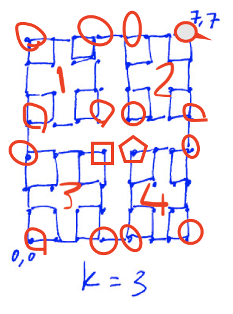
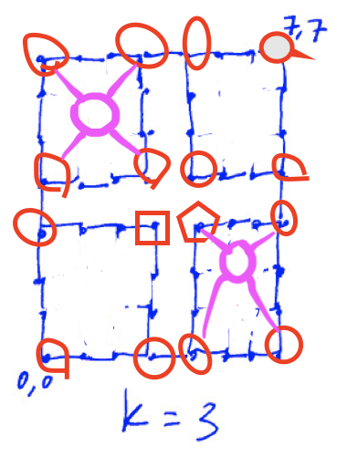

วิธีทำข้อนี้มีหลายแบบ ก่อนอื่นเราจะขอนิยาม "จุดสำคัญ" 16 จุดดังที่วงไว้ในวงกลมสีแดงในรูปข้างล่าง และ โซนทั้งหมด 4 โซน

สมมติว่าจุดทั้งสองจุดที่ถามอยู่ในโซนเดียวกันในแผนภูมิขนาดหนึ่ง ให้เรา "ย่อ" เข้าไปในโซนนั้น ๆ ได้เลย เพราะเส้นทางที่สั้นที่สุดจะไม่ออกจากโซนนั้นแน่นอน เมื่อเราทำการย่อเข้าไป เราจะได้พิกัดใหม่และค่า $k$ ใหม่ ให้เราย่อไปเรื่อย ๆ จนกว่าจุดทั้งสองจุดจะอยู่คนละโซนกัน

จากนั้นให้เราคำนวณเส้นทางที่สั้นที่สุดระหว่างจุดที่เราถามและจุดสำคัญ 4 จุดที่อยู่รอบโซน ๆ นั้น เราสามารถทำได้โดยการ "ย่อ" เข้าไปในโซนย่อยของมันในโซนนั้นอีกเพื่อที่จะหาระยะที่สั้นที่สุดไปถึงจุดสำคัญ 4 จุดที่อยู่รอบโซนย่อย ๆ นั้น และคำนวณคำตอบโดยการลองทุก ๆ วิธีในการเดิน การย่อนั้นเราจะทำเป็นแบบ recursive นั่นคือเราจะย่อไปเรื่อย ๆ จนกว่าจะถึง base case แล้วค่อย ๆ คำนวณคำตอบมาในแต่ละชั้น

เมื่อเราระยะทางสั้นที่สุดระหว่างจุดที่เราจะถามและจุดสำคัญรอบ ๆ โซนมันสี่จุดแล้ว ให้เรามองเป็นกราฟ 18 จุดที่มีเส้นเชื่อมตามรูปที่ 2 โดยจุดยอดสีม่วงคือจุดที่เราถามและเส้นสีม่วงคือระยะทางที่เราคำนวณมา จากนั้นให้หาระยะทางที่สั้นที่สุดระหว่างจุดสีม่วงทั้งสองจุด โดยอาจจะใช้ algorithm อะไรก็ได้เนื่องจากกราฟมีขนาดเล็กมาก แต่ผู้เขียนแนะนำให้ใช้ floyd-warshall เพื่อความรวดเร็ว

เราจะได้อัลกอริธึมที่แก้ปัญหานี้ได้ใน $\mathcal{O}(4^2k+16^3)$
